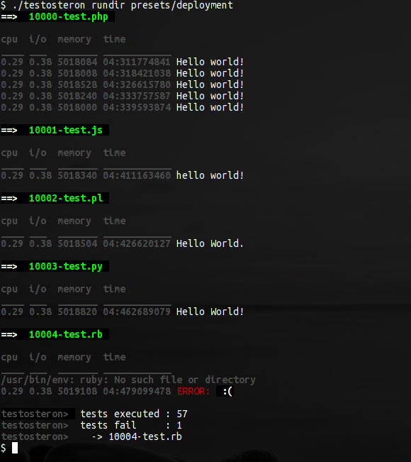

testosteron
===========

deadsimple unit/box/regression-testing-tool using bash & shebang files with *any* programminglanguage.

Why
===
PHPUnit or whatever-cool-programminglanguage-Unit is great..but sometimes bloated/limiting.
For those who need to test on many levels quickly: testosteron is here.
Most of the time developers know multiple programming languages, so testosteron allows testing in *any* programming language.
Testscripts are very easy, they just pass or fail using exitcode 0 or more.

How
===
Just drop this repository in your webapplication rootdir, and you are ready to go write some testscripts.
After that, just run:

    ./test run tests/white/10001-test.js 

Or for a whole dir with tests:

    ./test rundir tests/white 

Or a certain preset:

    ./test rundir presets/offline

Or if you want your tests to fail after a certain executiontime:

    PREFIX="timeout 1.3s" ./testosteron rundir presets/stress

What are these colornames?
==========================
Gray are [graybox test](http://en.wikipedia.org/wiki/Gray_box_testing), white are more detailed [whitebox tests](http://en.wikipedia.org/wiki/White-box_testing)
Optionally, make sure you have some cli-entrypoints in your webapplication, so you can easily access website/app configvariables within bash.

Notable features
================
Just using a teaspoon of bash you can:

* measure cpu,memory and i/o usage per test 
* compare with expected output (if a test like '10-foo.js' is accompanied with '10-foo.js.out')
* be flexible when what to tests (presets)
* its superportable: no frameworks/libs, just 1 file with 100% bash

Advanced Usage
==============
Testosteron was made with autodeployment in mind, therefore it works great with GIT & [Deployogi](https://github.com/coderofsalvation/deployogi).
If one pushes a new website to the server, deployogi runs all the tests, if the test fail, deployment will halt.
